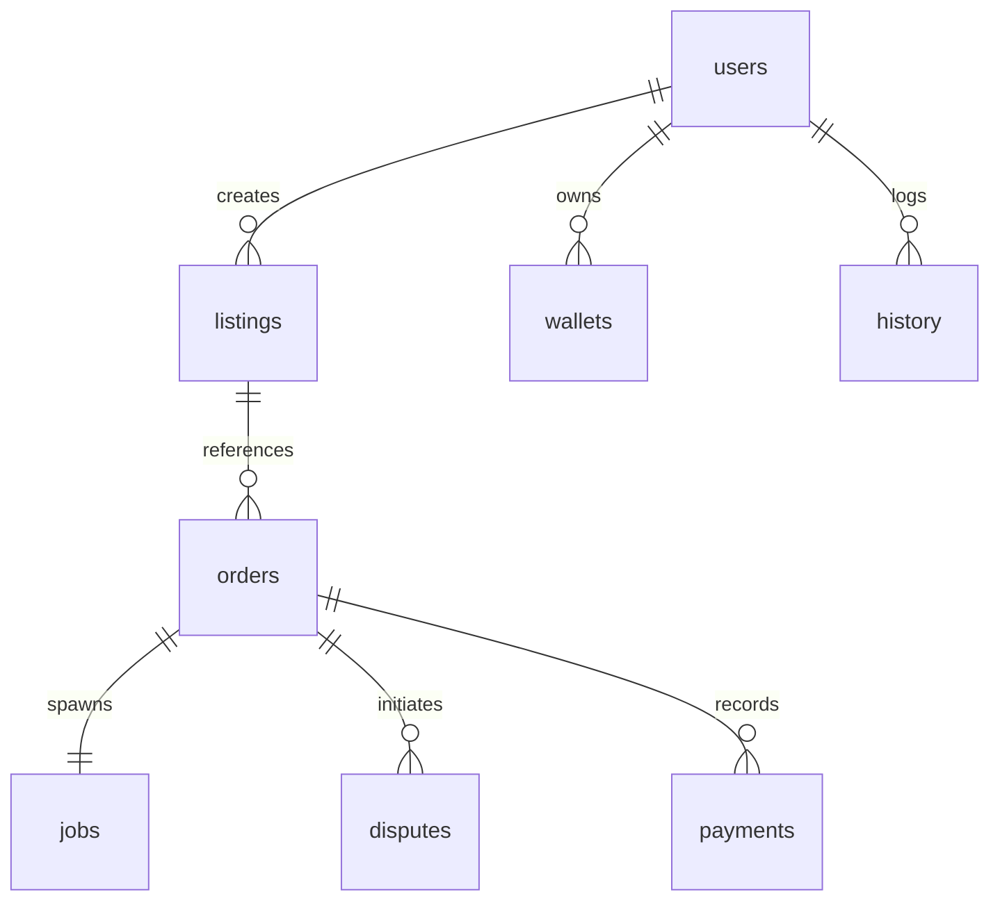
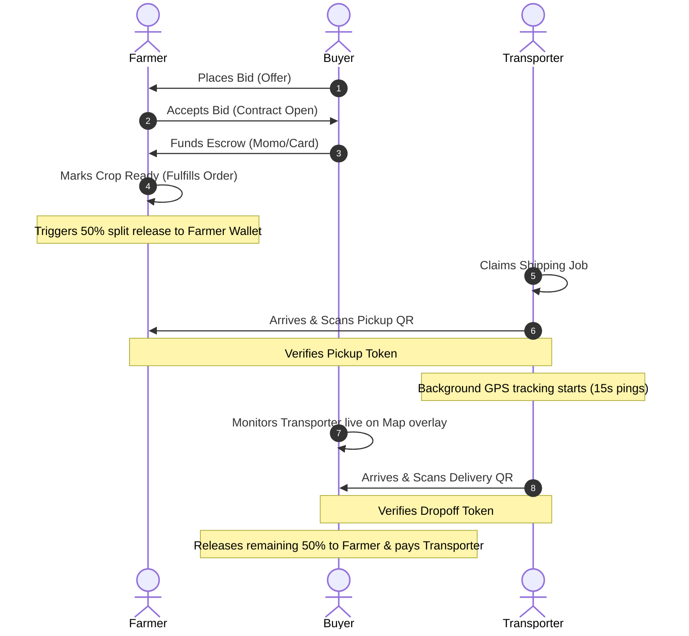

# AgriMate Monorepo — Technical Documentation & Architecture Manual

AgriMate is a decentralized peer-to-peer agritech ecosystem linking **Farmers**, **Buyers**, and **Transporters**. It secures crop transactions using a split-escrow payment ledger and integrates live geolocation cargo tracking.

---

## 1. Directory Structure

The project is structured as a Javascript monorepo:

```text
├── AgriMate db/              # SQL schemas and database migrations
├── AgriMate-backend/         # Node.js Express & Supabase PostgreSQL server
│   ├── controllers/          # Business logic controllers (Auth, Buyer, Farmer, Transporter)
│   ├── middleware/           # JWT and role-checking Express middleware
│   ├── routes/               # API route definitions
│   └── test-endpoints.js     # End-to-end integration test runner
└── Agrimate-Frontend/        # React Native / Expo Mobile Application
    ├── src/
    │   ├── context/          # Global state managers (e.g. AuthContext)
    │   ├── navigation/       # Stack & Tab Navigators
    │   ├── screens/          # Screen tabs grouped by role (Buyer, Farmer, Transporter)
    │   └── services/         # API HTTP request services
```

---

## 2. Database Models & Schema (PostgreSQL)

The system runs on Supabase (PostgreSQL). The tables interact as shown below:



### Table Definitions
1.  **`users`**: Stores credentials (email, password hash, names, vehicle numbers, and active role profiles: `'farmer'`, `'buyer'`, or `'transporter'`).
2.  **`listings`**: Crop sales announcements created by Farmers (crops, prices per pound, quantities, pictures, location details).
3.  **`orders`**: Active contracts between a Buyer and a Farmer (negotiated price, quantity, escrow status, delivery status, and live coordinates).
4.  **`jobs`**: Shipping contracts assigned to Transporters linked directly to active order shipments.
5.  **`wallets`**: Tracks users' settled balances and active escrow funds.
6.  **`disputes`**: Records contract claims filed by buyers regarding crop grade or delivery defaults.
7.  **`history`**: Audit trail records of wallet deposits, withdrawals, and contract releases.

---

## 3. Role-Based Workflow Cycle

The system coordinates transactions through a structured pipeline:



### Geolocation Architecture
To optimize rural access, the live tracking uses a **Hybrid Geolocation Mode**:
1.  **Driver Tracking (Low-Power)**: Broadcasts latitude and longitude periodically (using `expo-location` inside `DeliveryTab.js`) to backend `POST` routes. Loads zero maps or heavy tiles to save battery.
2.  **Farmer Dashboard (Data-Optimized)**: Displays coordinates as simple raw texts by default. Includes a manual toggle switch to load the map view container only when clicked.
3.  **Buyer Dashboard (Rich Tracking)**: Automatically loads a Google Map with markers. If connection is lost or maps crash, it falls back to raw coordinate texts and deep-links to native offline device maps.

---

## 4. Local Development Setup

### Backend Setup (`AgriMate-backend`)
1. Navigate to the backend directory and install dependencies:
   ```bash
   cd AgriMate-backend
   npm install
   ```
2. Create a `.env` file containing your Supabase Postgres connection credentials:
   ```env
   PORT=5000
   DB_USER=your_postgres_username
   DB_HOST=your_supabase_host
   DB_NAME=postgres
   DB_PASSWORD=your_database_password
   DB_PORT=5432
   JWT_SECRET=your_secure_jwt_passphrase
   ```
3. Run the database migration script:
   ```bash
   node run-migration.js
   ```
4. Start the Express development server:
   ```bash
   node server.js
   ```

### Frontend Setup (`Agrimate-Frontend`)
1. Navigate to the mobile app directory and install Expo modules:
   ```bash
   cd ../Agrimate-Frontend
   npm install
   ```
2. Start the Metro Bundler on a custom port to avoid local conflicts:
   ```bash
   npx expo start --android --go --port 8082
   ```
3. Boot the app on your running simulator:
   *   Press **`a`** inside the command line to open on the Android Emulator.
   *   Press **`i`** to open on the iOS Simulator.

---

## 5. Verification & Testing

The monorepo includes a complete end-to-end JWT integration test suite. This script runs automated registrations, bids, escrow funding, split payouts, pickup/dropoff confirmations, live coordinates syncing, disputes, and cleanup.

To run the full test suite:
```bash
cd AgriMate-backend
node test-endpoints.js
```
*(Ensure port `5000` is active and database tables are empty/accessible prior to executing).*

---

## 6. Coding & Architectural Guidelines

### Transaction Security
*   **Always Lock Wallet Rows**: Any query retrieving or updating balances must use `FOR UPDATE` transaction blocks. Refer to `getOrCreateWallet` inside [buyerController.js](file:///c:/Users/pc/OneDrive/Desktop/AgriMate%20APP/AgriMate-backend/controllers/buyerController.js#L583) as a reference.
*   **Isolate DB Connections**: Wrap pool queries in `BEGIN`, `COMMIT`, and `ROLLBACK` blocks inside try-catch-finally loops to clean up client allocations:
    ```javascript
    const client = await pool.connect();
    try {
      await client.query("BEGIN");
      // transactional updates
      await client.query("COMMIT");
    } catch (err) {
      await client.query("ROLLBACK");
    } finally {
      client.release();
    }
    ```

### Frontend Optimization
*   **Dynamic Component Loading**: Check for native libraries inside a try-catch blocks to prevent web or development-build runtime crashes:
    ```javascript
    let MapView;
    try {
      MapView = require('react-native-maps').default;
    } catch {
      MapView = null; // Fallback text coordinates UI
    }
    ```
